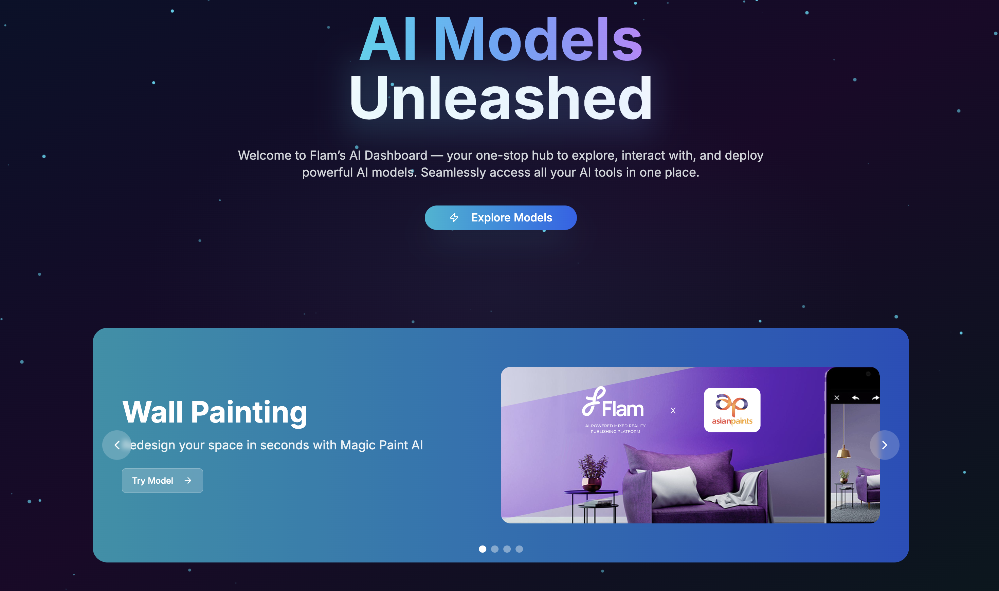

# Flam AI Dashboard🚀

Welcome to the Flam AI Dashboard, a modern, responsive web application built with Next.js and TypeScript. This platform serves as a central hub to interact with a suite of powerful, independently-hosted AI models through a sleek, futuristic user interface.

 

---

## ✨ Features

- **Dynamic & Animated UI:** Built with Framer Motion and Tailwind CSS for a fluid and engaging user experience.
- **Multi-Model Support:** A scalable architecture that supports multiple, independent AI models, each with its own dedicated page.
- **Secure API Proxy:** All communication with external AI services (like RunPod) is proxied through Next.js API routes, keeping API keys secure on the server.
- **Component-Based Architecture:** Uses reusable components built with `shadcn/ui` for consistency and maintainability.
- **Dynamic Example Loading:** Example images for models are dynamically loaded from the file system, making it easy to update without changing code.

### Implemented AI Models:
- **🎨 Wall Painting:** Virtually repaint walls in any room by uploading an image and selecting a color.
- **🗺️ PBR Map Generator:** Create a full set of Physically-Based Rendering (PBR) texture maps (Albedo, Normals, Roughness, etc.) from a single image.
- **👕 Virtual Try-On:** Swap clothing onto a human model by providing an image of the person and the garment.
- **🖼️ Image Composition Studio:** A Photoshop-like editor to compose images with layers, transforms, and AI processing.

---

## 🚀 Getting Started

Follow these instructions to get a copy of the project up and running on your local machine for development and testing purposes.

### Prerequisites

- [Node.js](https://nodejs.org/) (v18.x or later recommended)
- A package manager: `npm`, `yarn`, or `pnpm` (this project was set up with `pnpm`)

### Installation & Setup

1.  **Clone the repository:**
    ```bash
    git clone https://github.com/VinayakRai5/FlamAI-DashboardV2.git
    cd FlamAI-DashboardV2
    ```

2.  **Install dependencies:**
    ```bash
    npm install
    # or yarn install, or pnpm install
    ```

3.  **Set up environment variables:**
    Create a new file named `.env.local` in the root of the project and add your API keys and endpoints. Use the `.env.example` file as a template:
    ```
    # .env.local
    RUNPOD_API_KEY="your_runpod_api_key_here"
    
    # Endpoints for each model
    RUNPOD_ENDPOINT_CLOTHES="https://api.runpod.ai/v2/flly0i46nthx6x"
    RUNPOD_ENDPOINT_PBRMAP="https://api.runpod.ai/v2/23d00ny4wln7vq"
    # Add other endpoints as needed...
    RUNPOD_ENDPOINT_COMPOSITION="https://api.runpod.ai/v2/your_composition_id"
    ```

4.  **Run the development server:**
    ```bash
    npm run dev
    ```

Open [http://localhost:3000](http://localhost:3000) with your browser to see the result.

---

## 🛠️ Tech Stack

- **Framework:** [Next.js](https://nextjs.org/) 14 (App Router)
- **Language:** [TypeScript](https://www.typescriptlang.org/)
- **Styling:** [Tailwind CSS](https://tailwindcss.com/)
- **UI Components:** [shadcn/ui](https://ui.shadcn.com/)
- **Animation:** [Framer Motion](https://www.framer.com/motion/)
- **Icons:** [Lucide React](https://lucide.dev/)

---

## 📁 Project Structure

A brief overview of the key directories in this project:

-   **/app/api/**: Contains all server-side API routes that act as secure proxies to the AI models.
-   **/app/models/**: Each sub-folder here represents a dedicated page for an AI model (e.g., `/models/wall-painting`).
-   **/components/**: Shared, reusable React components (`ui` for shadcn components, `custom` for project-specific components).
-   **/public/**: Static assets like images, GIFs, and example files that are publicly accessible.
